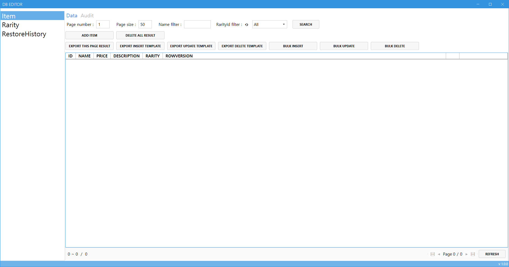
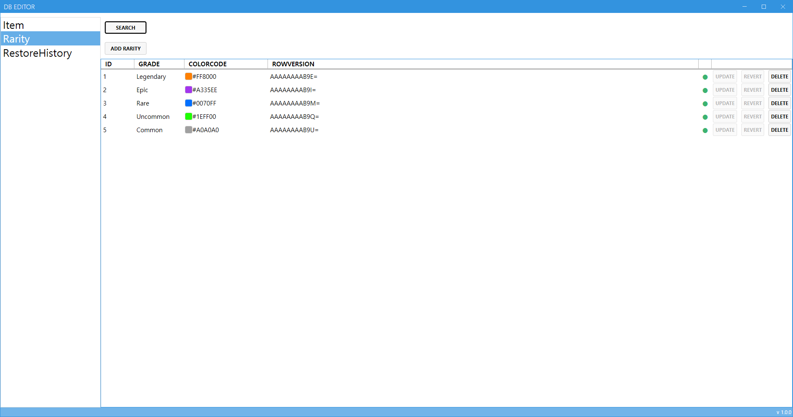
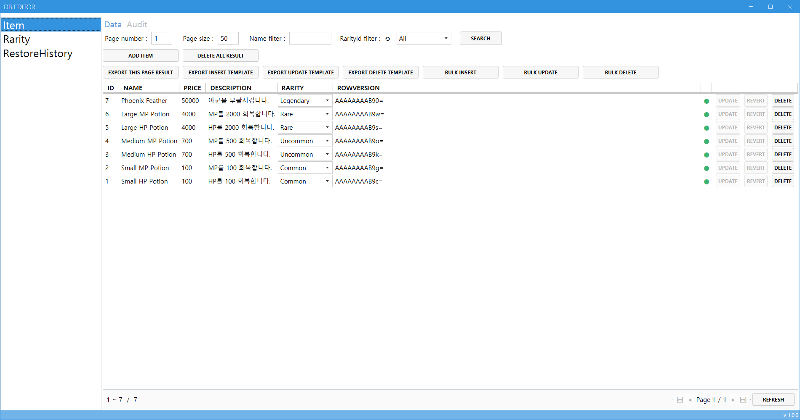
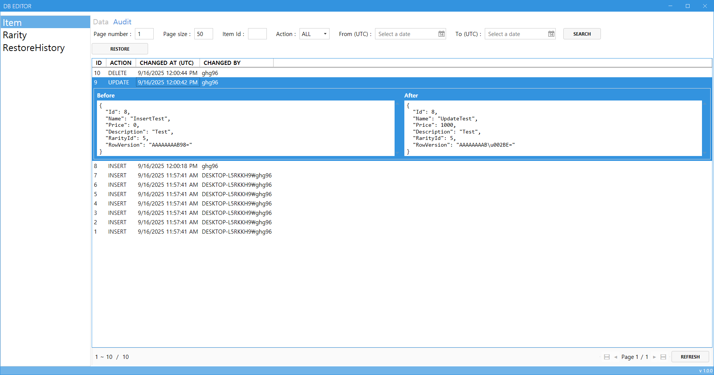
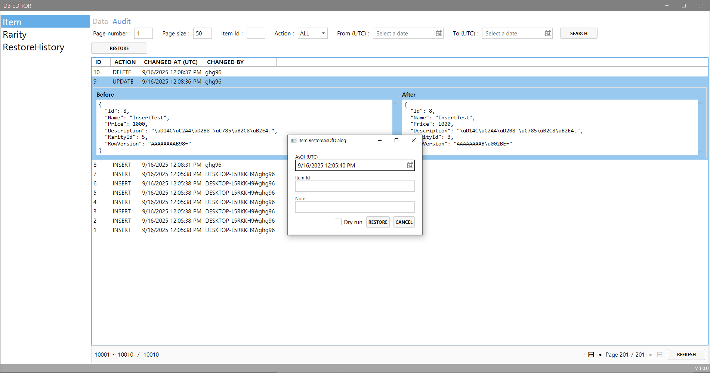
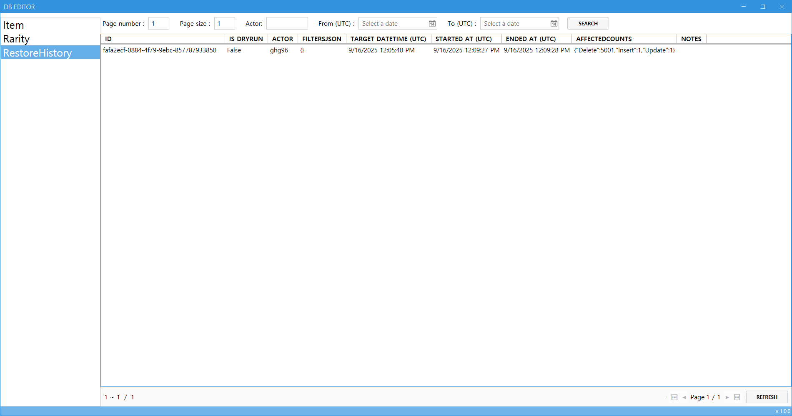
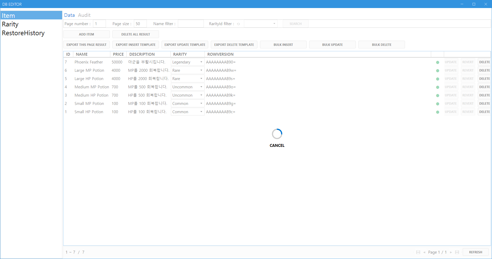

# GameTools

MSSQL 기반 서버와 WPF 클라이언트로 구성된 CRUD/일괄처리 데스크톱 앱입니다.  
**서버**는 데이터 처리·감사(Audit)·복구(Restore)를 담당하고, **클라이언트(WPF)** 는 조회·편집·CSV 일괄처리를 편리하게 제공합니다.

---

## UI

  
<strong>Screenshots</strong>

- **초기 UI**  
  

- **Rarity (등급 관리)**
  

- **Item (목록/편집/CSV 일괄 처리)**  
  

- **Item Audit (변경 이력 조회)**  
  

- **Restore Dialog (UTC 기준 복구)**  
  

- **Restore History (복구 이력 조회)**  
  

- **Spinner & Cancel (DB 연산 중 취소 지원)**  
  

---

## 주요 기능

- **엔터티:** `Item`, `Rarity` (Create / Update / Delete / Query)
- **Items 일괄 처리:** `BulkInsert / BulkUpdate / BulkDelete`
  - **CSV 입력 → TVP(Table-Valued Parameter)** 로 DB 저장
  - 처리 결과를 **CSV로 저장**(성공/실패/사유 요약)
- **동시성 제어:** `RowVersion`(타임스탬프) 기반 낙관적 동시성  
  → 다른 곳에서 먼저 변경하면 **업데이트/삭제 차단**
- **감사(Audit):** DB 트리거로 `INSERT/UPDATE/DELETE` 이력 자동 기록
  - WPF에서 **Item Audit 조회** 가능
  - **Restore(복구)** 가능, **Restore History** 기록/조회

---

## 아키텍처 개요
### Client

    Client/
    ├─ GameTools.Client.Application
    ├─ GameTools.Client.Domain
    ├─ GameTools.Client.Infrastructure
    └─ GameTools.Client.Wpf

### Server

    Server/
    ├─ Tests/
    │  └─ GameTools.Server.Test
    ├─ GameTools.Server.Api
    ├─ GameTools.Server.Application
    ├─ GameTools.Server.Domain
    └─ GameTools.Server.Infrastructure

### 공유 계약

    GameTools.Contracts

---

## 기술 스택

- **.NET**: .NET 9  
- **DB**: Microsoft SQL Server
- **ORM**: EF Core (마이그레이션)  
- **API**: ASP.NET Core Web API  
- **UI**: WPF + MVVM (CommunityToolkit.Mvvm) + MahApps
- **파일 I/O**: CSV Import/Export
